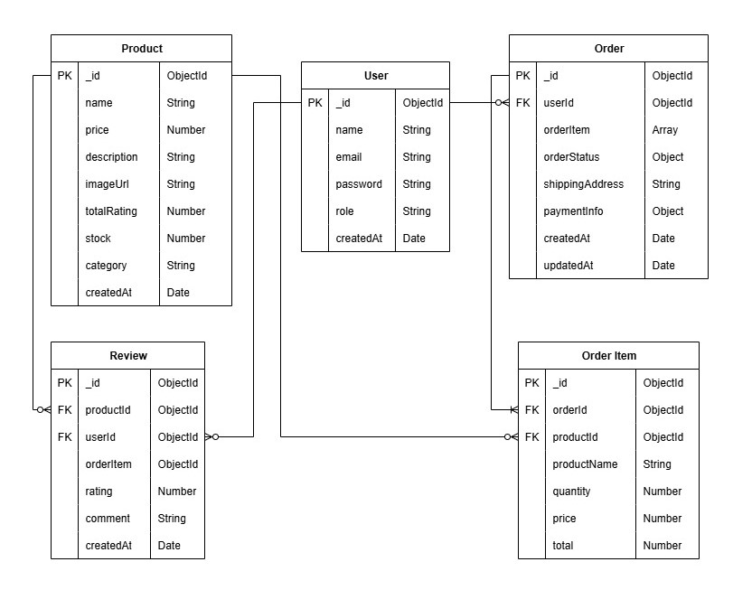

# Tech Space Server

## Introduction

**TechSpace** is a modern, scalable, and high-performance e-commerce platform designed to provide a seamless shopping experience for customers.  
Built with a robust tech stack, it supports advanced product browsing, filtering, secure checkout, and efficient admin management.

With **TechSpace**, customers can explore products across various categories, use advanced search and filtering options, manage their cart, place orders, pay via **SSL Commerz** and leave reviews for purchased items.  
Admins have complete control over products, orders, and user management through an intuitive dashboard.

## Tech stacks :

- Node.js & Express.js
- MongoDB & Mongoose-
- Cloudinary (Image Storage)
- SSL Commerz (Payment Gateway)
- JWT (Authentication & Authorization)

## Features

### Customer Features

- **User Authentication** – Secure sign-up and login via email/password.
- **Product Browsing** – Explore a wide range of products across categories.
- **Advanced Search & Filters** – Filter by category, price range, and more.
- **Cart Management** – Add products to cart and proceed to checkout.
- **Order Tracking** – View detailed order history and status updates.
- **Payment** - Customer can pay price via **SSL Commerz**
- **Product Reviews** – Leave and delete reviews for purchased products.

### Admin Features

- **Admin Dashboard** – Monitor and manage the platform.
- **User & Vendor Management** – Approve, suspend, or delete accounts.
- **Order Management** – View and update order statuses.

## Installation & Setup :

### Clone the Repository:

```plain
git clone https://github.com/md-suhag/tech-space-server.git
```

### Install Dependencies:

```markdown
npm install
```

### Environment Variables:

- Create a `.env` file in the root directory.
- Add the following environment variables:

```env
   CLIENT_URL = your_frontend_url
   MONGO_URI = mongodb_connection_url
   JWT_SECRET = jwt_secret
   CLOUDINARY_CLOUD_NAME = cloudinary_name
   CLOUDINARY_API_KEY = cloudinary_api_key
   CLOUDINARY_API_SECRET = cloudinary_api_secret
   SSL_COMMERZ_API_URL = ssl_commerz_api_url
   SSL_COMMERZ_STORE_ID = ssl_commerz_store_id
   SSL_COMMERZ_STORE_PASSWORD = ssl_commerz_store_password
   SSL_COMMERZ_TRANSACTION_QUERY_API = ssl_commerz_transaction_query_api
   SERVER_URL = your_server_url   # e.g., http://localhost:4005
```

### Run the Application:

```markdown
npm run dev
```

## ER Diagram



## 📦 API Endpoints

### Auth Routes (`/api/auth`)

| Method | Endpoint  | Description           | Auth Required     |
| ------ | --------- | --------------------- | ----------------- |
| POST   | /register | Register a new user   | ❌                |
| POST   | /login    | Login user            | ❌                |
| GET    | /me       | Get current user info | ✅ Admin/Customer |

---

### Product Routes (`/api/products`)

| Method | Endpoint  | Description           | Auth Required |
| ------ | --------- | --------------------- | ------------- |
| GET    | /         | Get all products      | ❌            |
| GET    | /featured | Get featured products | ❌            |
| GET    | /:id      | Get single product    | ❌            |
| POST   | /         | Create product        | ✅ Admin      |
| PUT    | /:id      | Update product        | ✅ Admin      |
| DELETE | /:id      | Delete product        | ✅ Admin      |

---

### Review Routes (`/api/reviews`)

| Method | Endpoint    | Description            | Auth Required     |
| ------ | ----------- | ---------------------- | ----------------- |
| GET    | /customer   | Get customer's reviews | ✅ Admin/Customer |
| GET    | /:productId | Get product reviews    | ❌                |
| POST   | /:productId | Create a review        | ✅ Customer       |
| DELETE | /:reviewId  | Delete a review        | ✅ Customer       |

---

### Order Routes (`/api/orders`)

| Method | Endpoint    | Description         | Auth Required |
| ------ | ----------- | ------------------- | ------------- |
| GET    | /           | Get all orders      | ✅ Admin      |
| GET    | /customer   | Get customer orders | ✅ Customer   |
| GET    | /:id        | Get single order    | ✅ Customer   |
| POST   | /           | Create order        | ✅ Customer   |
| PUT    | /:id/status | Update order status | ✅ Admin      |

---

### Payment Routes (`/api/payment`)

| Method | Endpoint          | Description            | Auth Required |
| ------ | ----------------- | ---------------------- | ------------- |
| POST   | /success/:orderId | Handle payment success | ❌            |
| POST   | /fail/:orderId    | Handle payment failure | ❌            |
| POST   | /cancel/:orderId  | Handle payment cancel  | ❌            |

## Error Handling

The application handles errors using global error handling with appropriate error messages and status codes.

### Thank you. Keep Creating.
